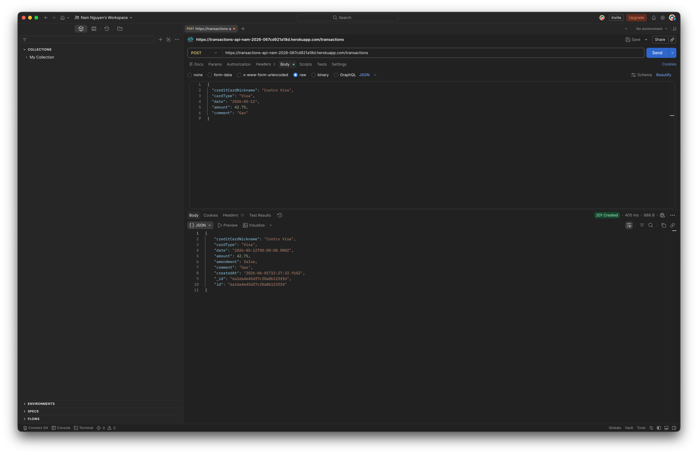
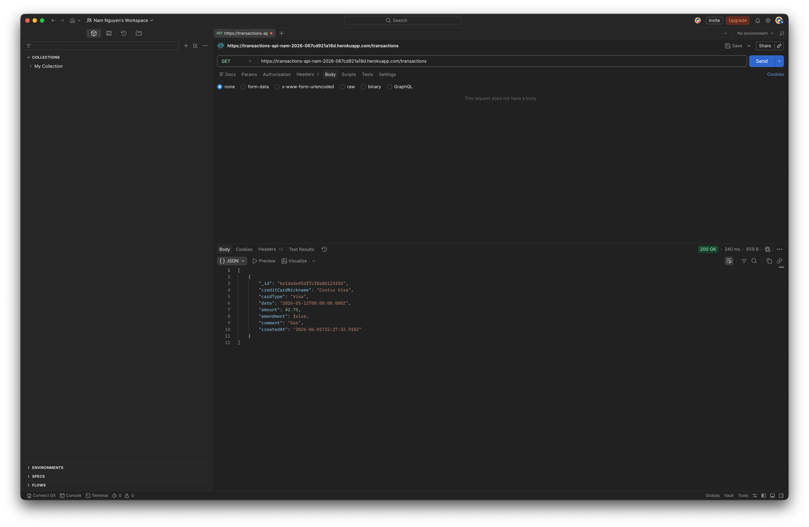
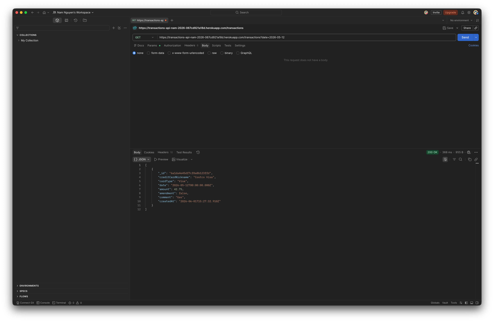
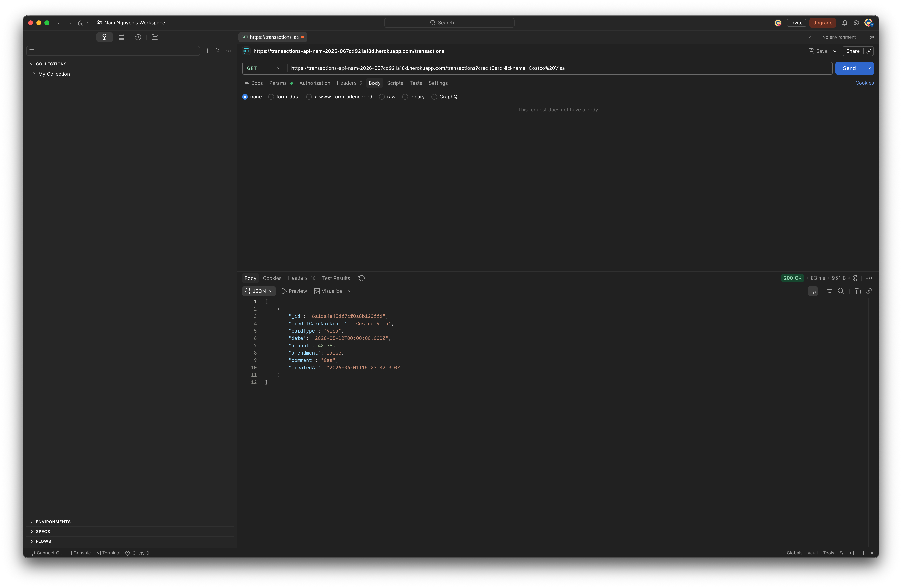

Transactions API
Activity Reflection
What were the new things you learned in this activity?
I learned a lot about the deployment pipeline for backend applications. Translating a local API to a live production environment like Heroku was a new challenge, especially making sure the production environment correctly handles routing compared to just running it on localhost:3000. I also learned how to properly configure and use Postman to test live, deployed endpoints.

What is the purpose of the seed.js program?
The seed.js file is a script used to populate the database with initial, dummy transaction data. It usually clears out the existing collection and inserts a fresh batch of predefined data. This is super helpful because it gives us immediate records to test our GET routes (like filtering by date or card nickname) without having to manually submit a bunch of POST requests first to build up a test database.

What was the most difficult thing to do in this activity?
The most difficult part was definitely the transition from local testing to interacting with the deployed app. Setting up Postman to properly hit the live Heroku URL instead of the local server took some troubleshooting. Ensuring the query parameters (like ?date=2026-05-12) and the JSON body payloads were perfectly structured to get a successful response in production required some trial and error.

How would you say you were prudent in this assignment?
I was prudent by making sure to test all my API routes locally first before pushing the code up to production. I also took my time double-checking my configurations in Postman, ensuring that my JSON syntax for the POST requests was exact so I wouldn't push malformed data to the live database.

How would you say you need to be prudent when developing this kind of web applications?
When building backend APIs, you have to be extremely careful with environment variables and security. It's crucial not to hardcode sensitive things like database credentials or connection strings into the source code that gets committed to GitHub. Additionally, being prudent means implementing solid error handling and data validation—if a client sends a string instead of a decimal for a transaction amount, the server needs to reject it gracefully rather than crashing the whole system.

Deployment URL
https://transactions-api-nam-2026-067cd921a18d.herokuapp.com

Postman Screenshots
(Below are the screenshots of Postman testing the live Heroku deployment)
## Postman Screenshots

**1. Create a transaction (POST)**

**2. Get all transactions (GET)**

**3. Get by date (GET)**

**4. Get by date range (GET)**

**5. Get by card nickname (GET)**
